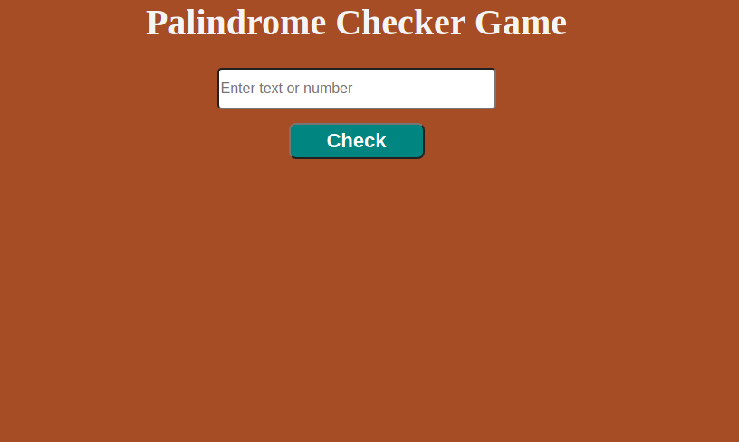
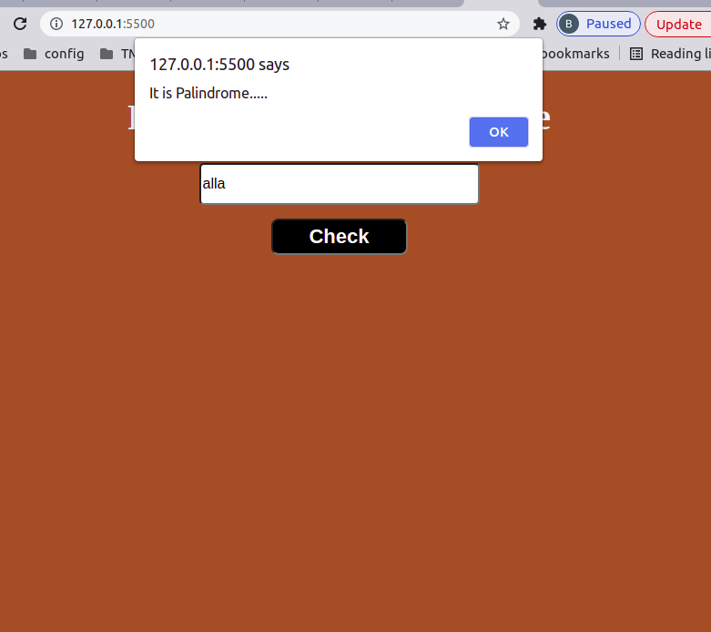
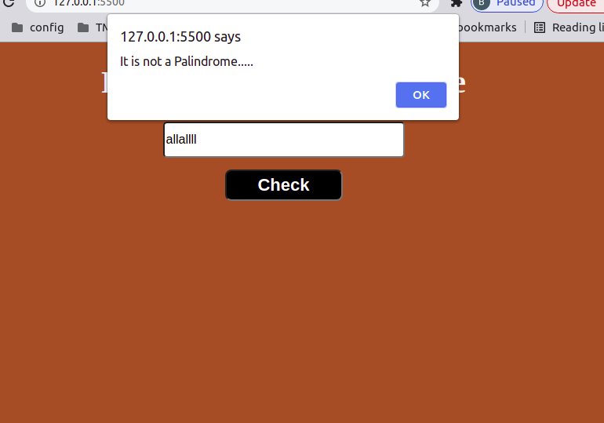

# JAVASCRIPT DOC ASSIGNMENT 05

This is my 5th Javascript Doc Assignment.

This is my Palindrome Checker Game...

### Output Image

**Tech Used**

- HTML
- CSS
- JAVASCRIPT

### TimeTaken

This Assignment took around 1 hour to complete it...
